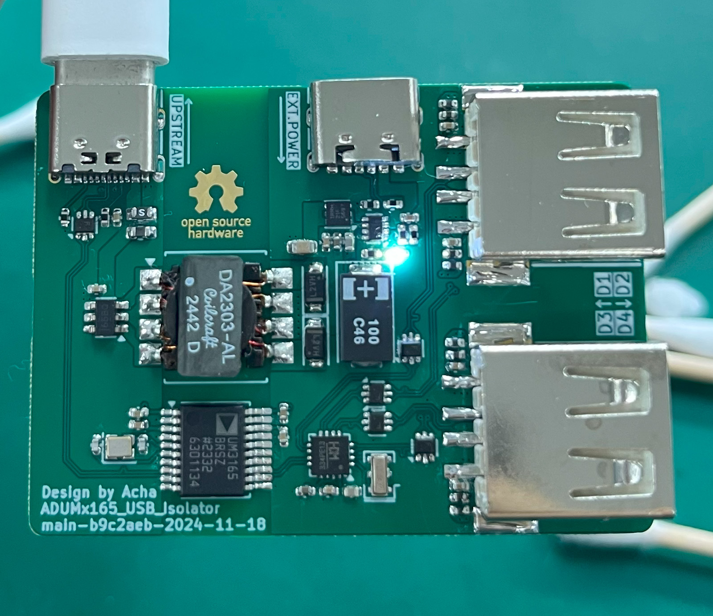

# ADUMx165 USB Isolator

[Chinese Document / 中文文档](./readme.zh.md) | English Document

This is a USB 2.0 High-Speed (480Mbps) isolation module with an onboard 1-to-4 USB HUB, a 1A isolated DC-DC power supply, and support for external auxiliary power input with automatic switching between the two.

## Project Status

- [x] Schematic Design
- [x] PCB Design
- [x] PCB Fabrication
- [x] PCB Validation

## Device Overview

- **[ADUM3165](https://www.analog.com/en/products/adum3165.html)/[ADUM4165](https://www.analog.com/en/products/adum4165.html) USB Isolator**: Provides 480Mbps USB isolation with 3.75kV/5.7kV RMS isolation voltage. Pin-to-pin compatible.
- **[SN6505A](https://www.ti.com/product/SN6505A)/[B](https://www.ti.com/product/SN6505B) Transformer Driver**: An isolated DC-DC power controller powered directly from the upstream USB port. The two variants differ in switching frequency.
- **[DA2303-AL](https://www.coilcraft.com/en-us/products/transformers/power-transformers/isolation/da230x/da2303-al) Transformer**: 1:1.5 SMT transformer.
- **[TPS2116](https://www.ti.com/product/TPS2116) Power Multiplexer**: Prioritizes 5V auxiliary power from the downstream port. When unavailable, it automatically switches to the onboard isolated DC-DC power supply.
- **[TLV76750](https://www.ti.com/product/TLV767) LDO**: Regulates the output of the SN6505.
- **[CH334P](https://www.wch-ic.com/products/CH334.html) USB Hub**: A simple USB 2.0 1-to-4 HUB chip.

## Basic PCB Parameters

| Parameter               | Value                  |
|:-----------------------:|:----------------------:|
| **Dimensions**           | 50.00mm x 36.50mm     |
| **Shape**                | Rounded Rectangle, r=1.50mm |
| **Finished Thickness**   | 1.60mm                |
| **Copper Layers**        | 4                     |
| **Minimum Trace Width**  | 0.12mm                |
| **Minimum Trace Space**  | 0.12mm                |
| **Minimum Via Hole Diameter** | 0.20mm         |
| **Minimum Non-plated Hole Diameter** | >1.00mm |
| **Minimum Via Outer Diameter** | 0.45mm         |
| **Minimum Via Inner Diameter** | 0.20mm         |
| **Minimum Plated Slot Width** | 0.60mm          |
| **Minimum Non-plated Slot Width** | None        |
| **Special Manufacturing Processes** | Impedance Control |

## Impedance Control Parameters

### Differential Impedance 1

| Usage           | USB 2.0 Signals          |
|:---------------:|:------------------------:|
| **Signal Layers** | L1, L4                 |
| **Impedance**     | 90Ω                    |
| **Bottom Reference Layers** | L2, L3       |
| **Top Reference Layer** | None             |

| Current Design Parameters | Value            |
|:-------------------------:|:----------------:|
| **Trace Width**            | 0.12mm          |
| **Trace Spacing**          | 0.12mm          |
| **Copper Thickness**       | 1oz/0.5oz       |
| **Applicable PCB Stackup** | JLCPCB JLC04161H-3313 |

## Project Description

This project was designed using KiCad 8.06.

GitHub Action CI/CD is deployed, which automatically performs DRC checks and generates manufacturing files (e.g., Gerber files) with each commit.

Manufacturing files are available on the [Release Page](https://github.com/acha666/ADUMx165_USB_Isolator/releases) or the [Workflow](https://github.com/acha666/ADUMx165_USB_Isolator/actions/workflows/kicad-ci.yml).

### Power Design

The module includes a 1A onboard isolated DC-DC power supply and supports external auxiliary power input with automatic switching. The onboard LED indicates that the isolated-side 5V is provided by the onboard DC-DC power supply.

- When using a 5V external auxiliary power supply, the output ports prioritize this external power. The total output capacity depends on the external power supply. Each port is equipped with a self-recovering fuse, limiting current to 500mA.
- When no external power is connected, the onboard isolated DC-DC power supply generates 5V. The total output capacity is limited by both the isolated DC-DC power supply and the upstream USB port.

**Note**: The external auxiliary power supply must not be connected to the same device as the upstream USB port; otherwise, isolation will fail.

### Device Selection Recommendations

#### ADUM3165/4165

According to the [datasheet](https://www.analog.com/media/en/technical-documentation/data-sheets/adum3165-3166.pdf), both are pin-to-pin compatible. The main difference lies in the isolation voltage: 3.75kV for ADUM3165 and 5.7kV for ADUM4165. The test board uses ADUM3165.

#### SN6505A/B

SN6505A has a switching frequency of 160kHz, while SN6505B operates at 420kHz. The test board uses SN6505B.

Per the [datasheet, page 30](https://www.ti.com/lit/ds/sllsep9i/sllsep9i.pdf#page=30), both can be paired with the DA2303-AL transformer. However, SN6505A remains untested.

#### DA2303-AL

**Not recommended for substitution**, as it is optimized for SN6505A/B. Other models may require additional tuning.

#### Ferrite Beads (5 in total)

Based on the schematic, there are 0603 ferrite beads near the upstream input port and 0402 beads near the downstream USB ports (4 in total).

Ferrite beads are used to isolate power noise. Considering that USB ports may carry significant current under extreme conditions, their DC resistance (DCR) should be as low as possible to prevent overheating and voltage drops.

The test board uses the following components:

| Parameter\Model | BLM18SG121TN1D   | BLM15PX121SN1D   |
|:---------------:|:----------------:|:----------------:|
| Impedance       | 120Ω @ 100MHz    | 120Ω @ 100MHz    |
| Package Size    | 0603             | 0402             |
| DCR             | 25mΩ             | 55mΩ             |
| Rated Current   | 5A               | 3A               |

To reduce costs, ferrite beads can be replaced with 0Ω resistors.

#### Tantalum Capacitors

These prevent power instability on the isolated side during external power connection/disconnection. They can be omitted to save costs.

Tantalum capacitors are highly sensitive to overvoltage and polarity reversal, often failing catastrophically. It is recommended to select capacitors with a voltage rating at least twice the operating voltage (5V * 2 = 10V) and ensure correct polarity during soldering (the stripe mark typically indicates the positive terminal). This design uses 16V-rated tantalum capacitors.

### Notes

Currently, the TLV76750 is configured for a fixed 5V output. Under heavy load, line losses may reduce the output voltage. It can be replaced with the adjustable TLV76701 in future iterations, with the output voltage set to approximately 5.2V.

This document was translated by ChatGPT.
