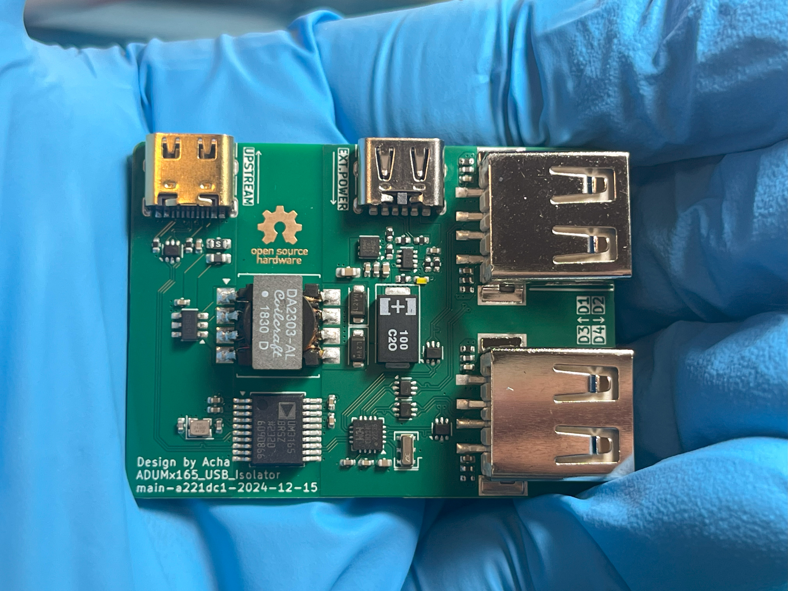
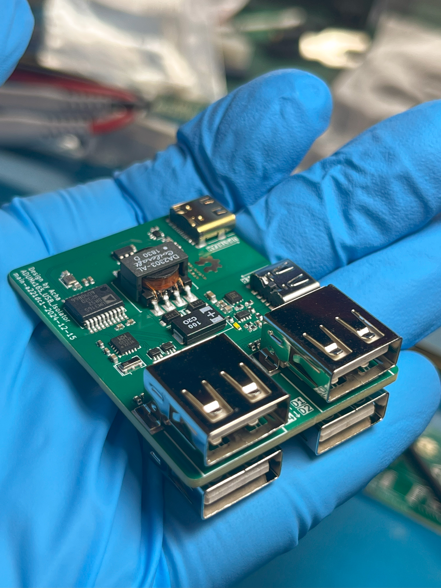

<!--

将如下 readme.md 文件翻译为英文，尽可能保证原有格式不变。添加该文档由ChatGPT翻译的备注。

所有形如 https://www.ti.com/product/SN6505A 的链接，替换为 https://www.ti.com/product/SN6505A

所有形如 https://www.analog.com/en/products/adum3165.html 的链接，替换为 https://www.analog.com/en/products/adum3165.html

为中文文档添加到 ./readme.zh.md 的链接。

以下为其他需要替换的链接：

[CH334P](https://www.wch.cn/products/CH334.html) -> https://www.wch-ic.com/products/CH334.html

[数据手册第30页](https://www.ti.com.cn/cn/lit/ds/zhcse71i/zhcse71i.pdf#page=30) -> https://www.ti.com/lit/ds/sllsep9i/sllsep9i.pdf#page=30

以下为其他需要替换的名词：

嘉立创 JLC04161H-3313 -> JLCPCB JLC04161H-3313

-->

# ADUMx165 USB Isolator

[英文文档 / English Document](./readme.md) | 中文文档 / Chinese Document

这是一款 USB 2.0 高速（480Mbps）隔离模块，板载 1 分 4 USB HUB、1A 隔离 DC-DC 电源，并支持外部辅助电源输入，二者可自动切换。

 

## 项目状态

- [x] 原理图设计
- [x] PCB 设计
- [x] PCB 制造
- [x] PCB 验证

## 器件概览

- **[ADUM3165](https://www.analog.com/cn/products/adum3165.html)/[ADUM4165](https://www.analog.com/cn/products/adum4165.html) USB 隔离器**：提供 3.75kV/5.7kV RMS 下的 480Mbps USB 隔离，二者针脚兼容。
- **[SN6505A](https://www.ti.com.cn/product/cn/SN6505A)/[B](https://www.ti.com.cn/product/cn/SN6505B) 变压器驱动器**：直接从上游 USB 端口取电的隔离 DC-DC 电源控制器，二者开关频率不同。
- **[DA2303-AL](https://www.coilcraft.com/en-us/products/transformers/power-transformers/isolation/da230x/da2303-al) 变压器**：1:1.5 SMT 变压器。
- **[TPS2116](https://www.ti.com.cn/product/cn/TPS2116) 电源多路复用器**：优先从下行端口获取 5V 辅助电源，当该电源不可用时，自动切换至板载隔离 DC-DC 电源。
- **[TLV76701](https://www.ti.com.cn/product/cn/TLV767) LDO**：用于 SN6505 输出的稳压。
- **[CH334P](https://www.wch.cn/products/CH334.html) USB Hub**：简单的 USB 2.0 一拖四 HUB 芯片。

## 基本电路板参数

| 参数           | 数值              |
|:-------------:|:----------------:|
| **尺寸**       | 50.00mm x 36.50mm |
| **形状**       | 圆角矩形，r=1.50mm |
| **成品板厚**   | 1.60mm            |
| **铜箔层数**   | 4                  |
| **最小线宽**   | 0.12mm             |
| **最小线距**   | 0.12mm             |
| **最小金属化孔径** | 0.20mm          |
| **最小非金属化孔径** | >1.00mm      |
| **最小过孔外径** | 0.45mm            |
| **最小过孔内径** | 0.20mm            |
| **最小金属化槽宽** | 0.60mm         |
| **最小非金属化槽宽** | 无              |
| **特殊制造工艺** | 阻抗控制          |

## 阻抗控制参数

### 差分阻抗 1

| 用途           | USB 2.0 信号       |
|:-------------:|:----------------:|
| **信号层**     | L1, L4            |
| **阻抗**       | 90Ω               |
| **下参考层**   | L2, L3            |
| **上参考层**   | 无                |

| 当前设计参数  | 数值              |
|:-------------:|:----------------:|
| **线宽**       | 0.12mm            |
| **线距**       | 0.12mm            |
| **铜箔厚度**   | 1oz/0.5oz         |
| **适用板厂叠层** | 嘉立创 JLC04161H-3313 |

## 项目说明

本项目使用 KiCad 8.06 进行设计。

已部署 GitHub Action CI/CD，每次提交都会自动执行 DRC 检查，并生成 Gerber 等制造文件。

制造文件可在 [Release 页面](https://github.com/acha666/ADUMx165_USB_Isolator/releases) 或 [Workflow](https://github.com/acha666/ADUMx165_USB_Isolator/actions/workflows/kicad-ci.yml) 下载。

### 电源设计

项目板载 1A 隔离 DC-DC 电源，并支持外部辅助电源输入，二者自动切换。板载LED亮起时表示隔离侧5V由板载DC-DC电源提供。

- 使用 5V 外部辅助电源时，输出端口优先使用外部电源供电，总输出能力受外部电源限制。每个接口均配有独立的板载自恢复保险丝，限流 500mA。
- 当未外接外部电源时，板载隔离 DC-DC 电源将生成 5V 供电，总输出能力受隔离 DC-DC 电源和上行 USB 端口共同限制。

请注意，外部辅助电源不得与上行 USB 端口连接至同一设备，否则会导致隔离失效。

2024.12.15更新：此前 TLV76750 为 5V 固定输出，在负载过大时由于线路损耗可能导致输出电压下降。已更换为可调输出电压的 TLV76701 并将输出电压设置在 5.2V 。

### 器件选型建议

#### ADUM3165/4165

根据 [数据手册](https://www.analog.com/media/en/technical-documentation/data-sheets/adum3165-3166.pdf) ，二者应 Pin-to-Pin 兼容。二者的主要区别在于隔离电压等级，前者为 3.75kV，后者为 5.7kV。测试板使用的是 ADUM3165。

#### SN6505A/B

SN6505A 的开关频率为 160kHz，SN6505B 的开关频率为 420kHz。测试板使用的是 SN6505B。

根据 [数据手册第30页](https://www.ti.com.cn/cn/lit/ds/zhcse71i/zhcse71i.pdf#page=30)， 二者都可以与变压器 DA2303-AL 配合使用。但 SN6505A 尚未测试。

#### DA2303-AL

**不建议更换**，该型号是专为 SN6505A/B 优化的变压器，其他型号可能需要进一步调试。

#### 磁珠（共 5 个）

根据原理图，上行信号输入接口旁有 0603 封装的磁珠，下行USB端口（共 4 个）旁有 0402 封装的磁珠。

磁珠用于隔离电源噪声，鉴于极端情况下 USB 端口可能会通过较大电流，磁珠的直流电阻（DCR）应该尽可能小以避免大量发热和电压损耗。

测试板使用物料如下

| 参数\型号 | BLM18SG121TN1D | BLM15PX121SN1D |
|:------:|:-----------:|:------------:|
| 阻抗 | 120Ω @ 100MHz | 120Ω @ 100MHz |
| 封装尺寸 | 0603 | 0402 |
| DCR | 25mΩ | 55mΩ |
| 额定电流 | 5A | 3A |

若出于节省成本考虑，磁珠也可以用 0Ω 电阻代替。

#### 钽电容

作用为在连接/断开外部电源时防止隔离侧电源抖动。若出于节省成本考虑，可以不焊接。

钽电容对过压和反接极其敏感，并且失效时通常伴随明火甚至爆炸。建议选用耐压值至少为额定电压两倍（ 5V * 2 = 10V ）的器件，并且在焊接时注意极性（通常钽电容竖线标记侧为正极）。本设计使用耐压值为 16V 的钽电容。

### 备注
